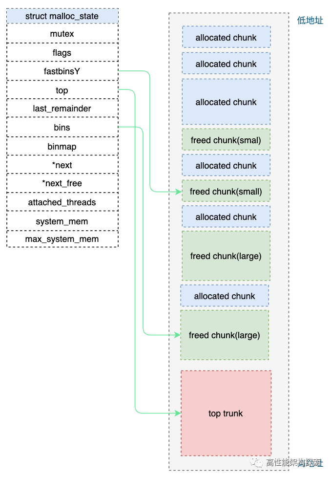
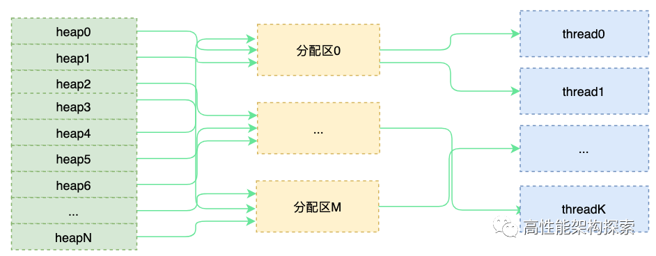
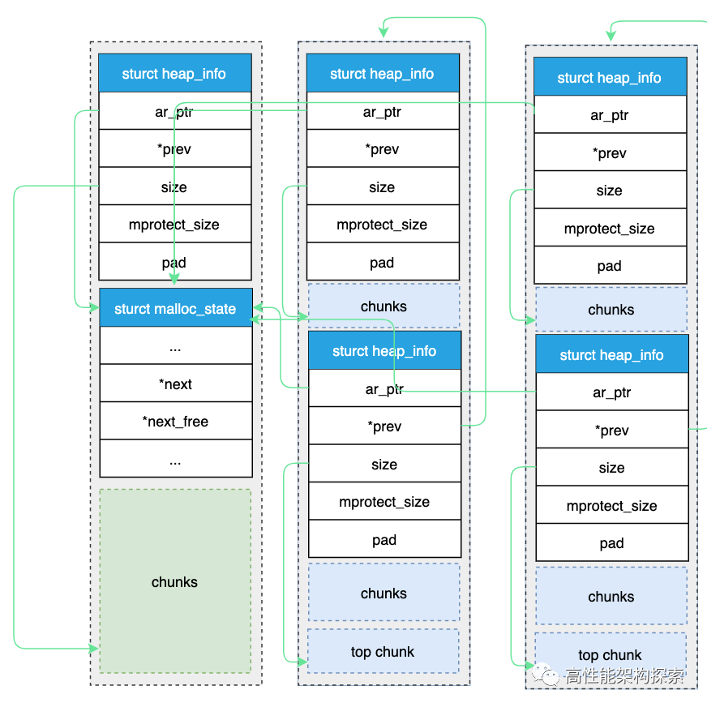
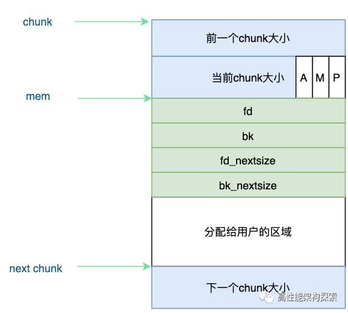
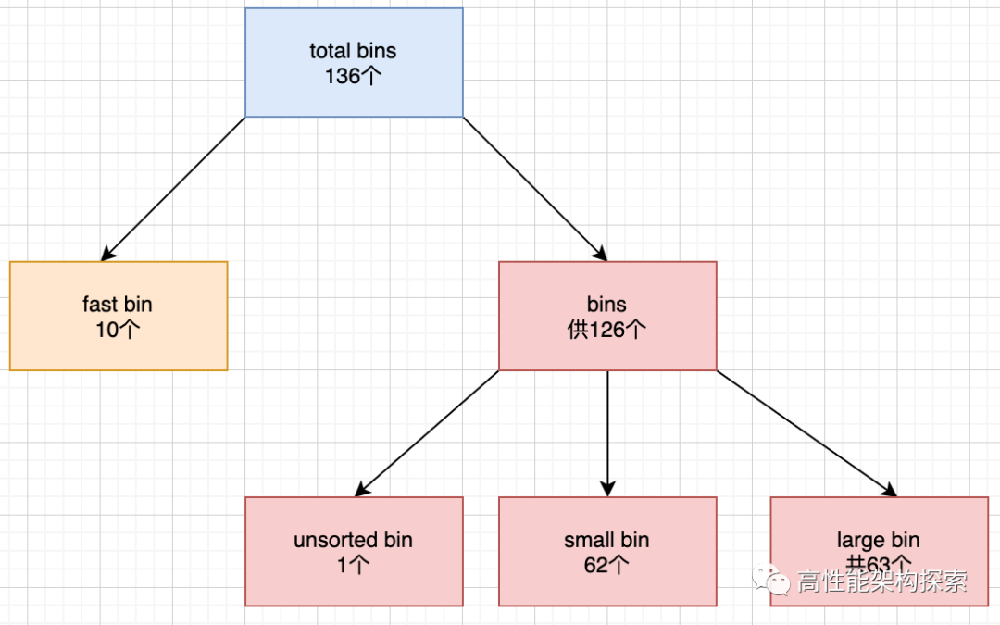

### 内存介绍

参考文章：

- https://zhuanlan.zhihu.com/p/344377490
- https://zhuanlan.zhihu.com/p/534476057
- https://mp.weixin.qq.com/s/pdv5MMUQ9ACpeCpyGnxb1Q
- https://www.zhihu.com/question/33979489/answer/1854635802


​	我们先看下内存的概念,系统会给每一个进程一个0x00000000~0xfffffff的虚拟内存空间。这一段内存空间被划分很多段，我们常说的内存布局如下：(关于虚拟内存详细的介绍和解释后续再其他章节补充)

​	

​	内存布局分为：**代码区、数据区、BSS区、堆区、栈区**。每一次段的作用的详细内容后面再说。我们程序使用的主要是堆和栈，其中又以堆区是我们主要使用的内存区域，常见的<font color= 'red'>内存泄露是指每次从堆区申请的内存没有释放，下一次继续申请，多次重复后导致可用内存耗尽，从而无法再从系统获取到内存的问题。</font>

为什么需要进行内存管理?

​	我们在堆上申请内存的时候存在两个函数，分别是brk()系统调用和sbrk()c运行时库函数， 在内存映射区分配内存有mmap函数。但是如果我们每一次内存使用都调用brk()、sbrk()或者是mmap()函数进行多次内存分配，那么肯定会造成频繁的系统调用，直接和操作系统操作性能会变得很慢。所以我们需要进行<font color = "yellow">内存管理。</font>		

### C内存管理

###### 内存相关函数

​	`malloc/calloc/realloc/free`

​	`malloc`: 在内存的堆区中分配一块长度为`size`字节的连续区域，参数size为需要的内存空间的长度，返回内存首地址。

​	`calloc`: 同malloc相同，但是calloc会将分配的内存空间中的每一位都初始化为零。

​	`realloc`: 给已经分配了地址的指针重新分配空间，可以做到对动态开辟内存大小进行调整。

​	

Q: the different of this function?
A: 

​	1、函数malloc不能初始化所分配的内存空间,而函数calloc能.如果由malloc()函数分配的内存空间原来没有被使用过，则其中的每一位可能都是0;反之, 如果这部分内存曾经被分配过,则其中可能遗留有各种各样的数据。也就是说，使用malloc()函数的程序开始时(内存空间还没有被重新分配)能正常进行,但经过一段时间(内存空间还已经被重新分配)可能会出现问题。malloc到其他的内存了?导致这块内存可能还在使用，但是被其他的线程申请到了进行初始化。

​	2、函数calloc() 会将所分配的内存空间中的每一位都初始化为零,也就是说,如果你是为字符类型或整数类型的元素分配内存,那么这些元素将保证会被初始化为0;如果你是为指针类型的元素分配内存,那么这些元素通常会被初始化为空指针;

​	3、函数malloc向系统申请分配指定size个字节的内存空间.返回类型是 void类型.void表示未确定类型的指针.C,C++规定，void* 类型可以强制转换为任何其它类型的指针。

​	4、realloc可以对给定的指针所指的空间进行扩大或者缩小，无论是扩张或是缩小，原有内存的中内容将保持不变.当然，对于缩小，则被缩小的那一部分的内容会丢失.realloc并不保证调整后的内存空间和原来的内存空间保持同一内存地址.相反，realloc返回的指针很可能指向一个新的地址。

​	5、realloc是从堆上分配内存的.当扩大一块内存空间时，realloc()试图直接从堆上现存的数据后面的那些字节中获得附加的字节，如果能够满足，此时即原地扩；如果数据后面的字节不够，那么就使用堆上第一个有足够大小的自由块，现存的数据然后就被拷贝至新的位置，而老块则放回到堆上.这句话传递的一个重要的信息就是数据可能被移动，即异地迁移。但是如果是迁移，那么一定会带来性能问题，特别是多次的、大量的数据。

### C++内存管理

​	因为C++可以看成是C的延伸和扩展，所以C的内存管理方式在C++ 里面可以继续使用，但是C++又有一套自己的内存管理方式：通过new和delete操作符进行动态内存管理。

​	申请空间时：malloc只开空间，new是即会开空间又会调用构造函数。

​	释放空间时：delete会调用析构函数，free不会。

​	关于new和operator new等C++操作符封装后面再说~~

### 底层Malloc函数

​	glibc使用的内存管理器是ptmalloc。除此之外还有google的TCMalloc等等，我们C++使用的malloc\new\free\delete就是ptmalloc分配器。

​	其中glibc的内存分配器整体如下：

​			

​	堆的结构体数据如下

​	

```C
typedef struct _heap_info
{
  mstate ar_ptr;            /* Arena for this heap. */
  struct _heap_info *prev;  /* Previous heap. */
  size_t size;              /* Current size in bytes. */
  size_t mprotect_size;     /* Size in bytes that has been mprotected
                             PROT_READ|PROT_WRITE.  */
  /* Make sure the following data is properly aligned, particularly
     that sizeof (heap_info) + 2 * SIZE_SZ is a multiple of
     MALLOC_ALIGNMENT. */
  char pad[-6 * SIZE_SZ & MALLOC_ALIGN_MASK];
}
```

​	我们ar_ptr是指向分配区的指针，堆之间是通过链表的方式进行链接。

​	先看一张malloc内存申请流程图，底层使用链表实现了内存池:

​			

​	我们可以看到存在fastbin、smallbin、unsortedbin、largebin、tupchunk等等内存设计区域。这些设计一方面是为了减少和操作系统底层函数brk()、sbrk()和mmap()的直接交互次数、同时也可以达到快速分配内存的目的。

##### 分配区(arena)

​	在ptmalloc中，分配区分为主分配区和非主分配区，分配区用struct malloc_state表示。二者的区别是：主分配区可以使用sbrk()和mmap向os申请内存，而非主分配区只能通过mmap向系统申请内存。

​	当一个线程调用malloc申请内存的时候，这个线程会先查看线程私有变量中是否已经存在一个分配区。如果存在，那么会对这个分配器进行计加锁，加锁成功就用这个分配区进行内存分配；失败的话则会搜索环形链表找一个没有加锁的分配区。如果所有的分配区都加锁的话，那么malloc会开辟一个新的分配区加入环形链表并且加锁，用它来分配内存。那么释放操作同样也需要获得锁才能进行。

​	非主分配区是通过mmap向os申请内存的，一次申请64MB，一旦申请了，这个分配区是不会被释放的，但是为了避免无限的申请，ptmalloc对分配区是有个数限制的。

> 对于32位操作系统，分配区最大个数 = 2 * CPU核数 + 1
>
> 对于64位操作系统，分配区最大个数 = 8 * CPU核数 + 1

我们再看下堆管理的结构：

```cpp
struct malloc_state
{
 mutex_t mutex;                   /* Serialize access. */
 int flags;                       /* Flags (formerly in max_fast). */
 #if THREAD_STATS
 /* Statistics for locking. Only used if THREAD_STATS is defined. */
 long stat_lock_direct, stat_lock_loop, stat_lock_wait;
 #endif
 mfastbinptr fastbins[NFASTBINS];    /* Fastbins */
 mchunkptr top;
 mchunkptr last_remainder;
 mchunkptr bins[NBINS * 2];
 unsigned int binmap[BINMAPSIZE];   /* Bitmap of bins */
 struct malloc_state *next;           /* Linked list */
 INTERNAL_SIZE_T system_mem;
 INTERNAL_SIZE_T max_system_mem;
}
```



每一个分配区都有一个Mutex锁保证线程安全。每一个线程一定对应一个分配区，但是一个分配区可以给多个线程使用。同一个分配区可以由一个或者是多个堆组成，同一个分配区下的堆以链表的方式进行链接。关系如图：



一个进程的动态内存，由分配区管理，一个进程可以有多个分配区，一个分配区又有多个堆。



我们需要注意：

- 主分配区通过brk进行分配，非主分配区通过mmap进行分配。
- 每一个线程在malloc之前都会先获取一个area，使用area内存池分配自己的内存，这里存在竞争关系，因为一份分配区是可以给多个线程。
- 为了避免竞争我们使用线程局部存储--thread cache 线程局部存储对area的改成原理如下：
  - 如果需要一个线程内部的各个韩式调用都能访问、但是其他的线程不能访问的变量，需要TLS实现。
  - thread cache的本质是在static区为每一个thread开辟一个独有的空间
  - 线程每一次在malloc时，先去线程局部存储空间去找area。不够的情况下再去堆区找area。

##### chunk

​	ptmalloc通过malloc_chunk来管理内存。具体定义如下：

```cpp
struct malloc_chunk {  
  INTERNAL_SIZE_T      prev_size;    /* Size of previous chunk (if free).  */  
  INTERNAL_SIZE_T      size;         /* Size in bytes, including overhead. */  
  
  struct malloc_chunk* fd;           /* double links -- used only if free. */  
  struct malloc_chunk* bk;  
  
  /* Only used for large blocks: pointer to next larger size.  */  
  struct malloc_chunk* fd_nextsize;      /* double links -- used only if free. */  
  struct malloc_chunk* bk_nextsize; 
};  
```

- prev_size:如果前一个chunk是空的，则表示前一个chunk的大小，如果不是空则没有意思。(一段连续的内存被分成多个chunk，perv_size记录的就是相邻的前一个chunk的size，知道当前chunk的地址，减去perv_size就是前一个chunk的地址。主要是用于相邻的chunk合并)
- size:当前chunk的大小，还有当前chunk和前一个chunk的一些属性，前一个chunk是否在用，当前的chunk是否通过mmap获得内存，当前chunk是否属于非主分配区等等。
- fd和bk:指针 fd 和 bk 只有当该 chunk 块空闲时才存在，其作用是用于将对应的空闲 chunk 块加入到空闲chunk 块链表中统一管理，如果该 chunk 块被分配给应用程序使用，那么这两个指针也就没有用（该 chunk 块已经从空闲链中拆出）了，所以也当作应用程序的使用空间，而不至于浪费。
- fd_nextsize和bk_nextsize:当前的 chunk 存在于 large bins 中时， large bins 中的空闲 chunk 是按照大小排序的，但同一个大小的 chunk 可能有多个，增加了这两个字段可以加快遍历空闲 chunk ，并查找满足需要的空闲 chunk ， fd_nextsize 指向下一个比当前 chunk 大小大的第一个空闲 chunk ， bk_nextszie 指向前一个比当前 chunk 大小小的第一个空闲 chunk 。（同一大小的chunk可能有多块，在总体大小有序的情况下，要想找到下一个比自己大或小的chunk，需要遍历所有相同的chunk，所以才有fd_nextsize和bk_nextsize这种设计） 如果该 chunk 块被分配给应用程序使用，那么这两个指针也就没有用（该chunk 块已经从 size 链中拆出）了，所以也当作应用程序的使用空间，而不至于浪费。

我们可以看一下chunk的结构如下：



##### 空闲链表bins

​	当我们使用free释放内存的时候，ptmalloc并不会将操作系统立即归还给操作系统，而是将其放入到空闲链表中(bins)，这样子下次再调用malloc函数申请内存的时候，就会从bins中取出一块返回，避免频繁调用系统调用函数，从而降低内存分配开销。在ptmalloc中会将大小相似的chunk链接起来，叫做bin。总共会有128个bin。更具不同的chunk大小我们可以将bin分为以下几种:fast bin、unsordted bin、small bin、large bin。具体划分规则如下：



###### fast bin

​	因为大多数时候程序在运行的时候需要申请和释放一些较小的内存空间。当分配器合并了相邻的几个小的chunk之后，也许马上就要申请一个小块内存，这样子分配器有需要重新从大的空闲内存中切出一块，这样毫无疑问是低效的，所以引入了一个fast bin用于快速小内存的分配和释放。

- 每个fast bin是一个单链表(只使用fd指针)。这样子fastbin无论是添加还是移除chunk都是在链表尾进行操作的，所以对fastbin的chunk操做的是LIFO算法：添加操作(free内存)就是将新的fast chunk加入到链表尾部；删除操作就是将链表尾部的fast chunk删除。
- chunk size:10个fast bin中所包含的chunk size以8个字节逐渐递增，即第一个fast bin中chunk size均为16个字节，第二个fast bin的chunk size为24字节，以此类推，最后一个fast bin的chunk size为80字节。
- 不会对free chunk进行合并操作。这是因为fast bin设计的初衷就是小内存的快速分配和释放，因此系统将属于fast bin的chunk的P(未使用标志位)总是设置为1，这样即使当fast bin中有某个chunk同一个free chunk相邻的时候，系统也不会进行自动合并操作，而是保留两者。
- malloc操作：在malloc的时候，申请的内存大小范围(16~88)在fast bin的范围内，则先在fast bin中查找，如果找到了，则返回。否则则从small bin、unsorted bin以及large bin中查找。
- malloc操作：在malloc的时候，如果申请的内存大小范围在fast bin的范围内，则先在fast bin中查找，如果找到了，则返回。否则则从small bin、unsorted bin以及large bin中查找。

###### unsorted bin

​	unsorted bin的队列使用bins数组的第一个，是bins的一个缓冲区，加快分配的速度。当用户释放的内存大于max_fast