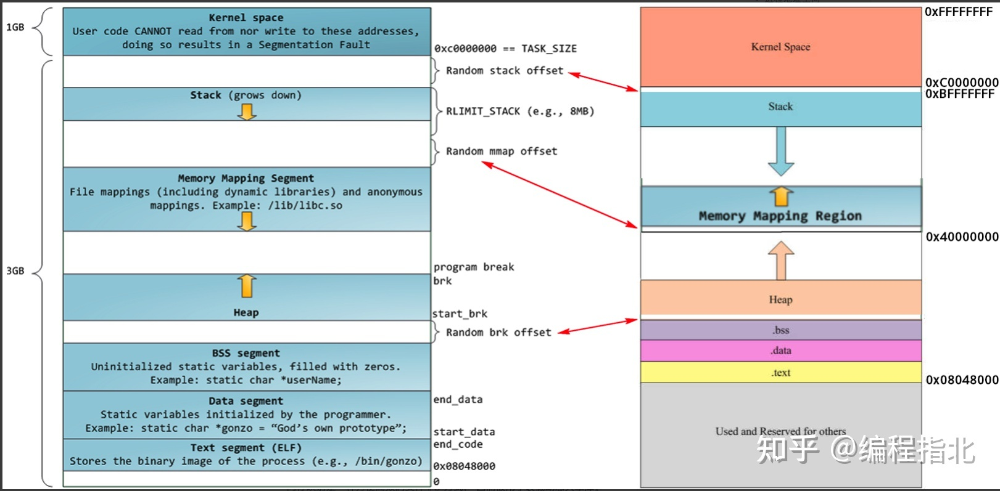
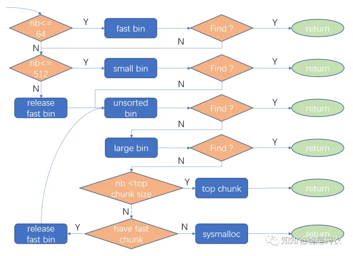

### 内存介绍

​	参考文章：

- https://zhuanlan.zhihu.com/p/344377490
- https://zhuanlan.zhihu.com/p/534476057
- https://mp.weixin.qq.com/s/pdv5MMUQ9ACpeCpyGnxb1Q
- https://www.zhihu.com/question/33979489/answer/1854635802


​	我们先看下内存的概念,系统会给每一个进程一个0x00000000~0xfffffff的虚拟内存空间。这一段内存空间被划分很多段，我们常说的内存布局如下：(关于这段虚拟内存详细的介绍和解释后续再其他章节补充)

​	

​	内存布局分为：**代码区、数据区、BSS区、堆区、栈区**。每一次段的作用的详细内容后面再说。我们程序使用的主要是堆和栈，其中又以堆区是我们主要使用的内存区域，常见的<font color= 'red'>内存泄露是指每次从堆区申请的内存没有释放，下一次继续申请，多次重复后导致可用内存耗尽，从而无法再从系统获取到内存的问题。</font>

为什么需要进行内存管理?

​	我们在堆上申请内存的时候存在两个函数，分别是brk()系统调用和sbrk()c运行时库函数， 在内存映射区分配内存有mmap函数。但是如果我们每一次内存使用都调用brk()、sbrk()或者是mmap()函数进行多次内存分配，那么肯定会造成频繁的系统调用，直接和操作系统操作性能会变得很慢。所以我们需要进行<font color = "yellow">内存管理。</font>		

### C内存管理

###### 内存相关函数

​	`malloc/calloc/realloc/free`

​	`malloc`: 在内存的堆区中分配一块长度为`size`字节的连续区域，参数size为需要的内存空间的长度，返回内存首地址。

​	`calloc`: 同malloc相同，但是calloc会将分配的内存空间中的每一位都初始化为零。

​	`realloc`: 给已经分配了地址的指针重新分配空间，可以做到对动态开辟内存大小进行调整。

​	

Q: the different of this function?
A: 

​	1、函数malloc不能初始化所分配的内存空间,而函数calloc能.如果由malloc()函数分配的内存空间原来没有被使用过，则其中的每一位可能都是0;反之, 如果这部分内存曾经被分配过,则其中可能遗留有各种各样的数据。也就是说，使用malloc()函数的程序开始时(内存空间还没有被重新分配)能正常进行,但经过一段时间(内存空间还已经被重新分配)可能会出现问题。malloc到其他的内存了?导致这块内存可能还在使用，但是被其他的线程申请到了进行初始化。

​	2、函数calloc() 会将所分配的内存空间中的每一位都初始化为零,也就是说,如果你是为字符类型或整数类型的元素分配内存,那么这些元素将保证会被初始化为0;如果你是为指针类型的元素分配内存,那么这些元素通常会被初始化为空指针;

​	3、函数malloc向系统申请分配指定size个字节的内存空间.返回类型是 void类型.void表示未确定类型的指针.C,C++规定，void* 类型可以强制转换为任何其它类型的指针。

​	4、realloc可以对给定的指针所指的空间进行扩大或者缩小，无论是扩张或是缩小，原有内存的中内容将保持不变.当然，对于缩小，则被缩小的那一部分的内容会丢失.realloc并不保证调整后的内存空间和原来的内存空间保持同一内存地址.相反，realloc返回的指针很可能指向一个新的地址。

​	5、realloc是从堆上分配内存的.当扩大一块内存空间时，realloc()试图直接从堆上现存的数据后面的那些字节中获得附加的字节，如果能够满足，此时即原地扩；如果数据后面的字节不够，那么就使用堆上第一个有足够大小的自由块，现存的数据然后就被拷贝至新的位置，而老块则放回到堆上.这句话传递的一个重要的信息就是数据可能被移动，即异地迁移。但是如果是迁移，那么一定会带来性能问题，特别是多次的、大量的数据。

### C++内存管理

​	因为C++可以看成是C的延伸和扩展，所以C的内存管理方式在C++ 里面可以继续使用，但是C++又有一套自己的内存管理方式：通过new和delete操作符进行动态内存管理。

​	申请空间时：malloc只开空间，new是即会开空间又会调用构造函数。

​	释放空间时：delete会调用析构函数，free不会。

​	关于new和operator new等C++操作符封装后面再说~~

### 底层Malloc函数

​	glibc使用的内存管理器是ptmalloc。除此之外还有google的TCMalloc等等，我们C++使用的malloc\new\free\delete就是ptmalloc分配器。

​	其中glibc的内存分配器整体如下：

​			

​	堆的结构体数据如下

​	

```C
typedef struct _heap_info
{
  mstate ar_ptr;            /* Arena for this heap. */
  struct _heap_info *prev;  /* Previous heap. */
  size_t size;              /* Current size in bytes. */
  size_t mprotect_size;     /* Size in bytes that has been mprotected
                             PROT_READ|PROT_WRITE.  */
  /* Make sure the following data is properly aligned, particularly
     that sizeof (heap_info) + 2 * SIZE_SZ is a multiple of
     MALLOC_ALIGNMENT. */
  char pad[-6 * SIZE_SZ & MALLOC_ALIGN_MASK];
}
```

​	我们ar_ptr是指向分配区的指针，堆之间是通过链表的方式进行链接。

​	先看一张malloc内存申请流程图，底层使用链表实现了内存池:

​			

​	我们可以看到存在fastbin、smallbin、unsortedbin、largebin、tupchunk等等内存设计区域。这些设计一方面是为了减少和操作系统底层函数brk()、sbrk()和mmap()的直接交互次数、同时也可以达到快速分配内存的目的。

###### 分配区(arena)

​	在ptmalloc中，分配区分为主分配区和非主分配区，分配区用struct malloc_state表示。二者的区别是：主分配区可以使用sbrk()和mmap向os申请内存，而非主分配区只能通过mmap向系统申请内存。