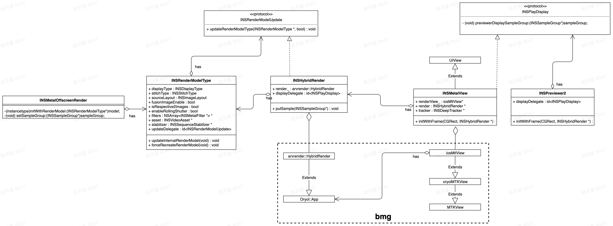

### 一、项目简介

BMG提供一个跨平台的全景渲染库`arvrender`，拥有以下特性：

- 跨平台。 支持 Windows/macOS/Linux/Android (iOS)。
- 跨图形API。底层使用跨 API 的图形 API 封装库 oryol， 支持 OpenGL (>=3.3)，OpenGL ES (>=3.0)， Metal， Direct3D
- 高效。各平台硬件解码器的视频帧高速上传作为纹理渲染, 支持从 GPU 中高效读出渲染帧，用做编码或者后处理

切换理由：

- 平台组IOSSDK中之前使用的是OpenGL作为渲染底层，但是Android使用的是又是BMG库，存在不统一问题。
- 原生OpenGL和封装BMG之间的差异.....(详细原因问强哥补充)

 参考文档

- https://gitlab.insta360.com/rd/avlab/bmg/-/blob/master/Doc/arvrender.md - (研究院封装)
- https://arashivision.feishu.cn/wiki/wikcnXlamUeGSz1ISH3oLaGyapc
- https://arashivision.feishu.cn/wiki/wikcnvLrNu4bl63pnvlMH9WRPNd#

### 二、整体架构

​	先看一张一期迁移后的类图：	

### 三、详细模块

### 四、具体使用

