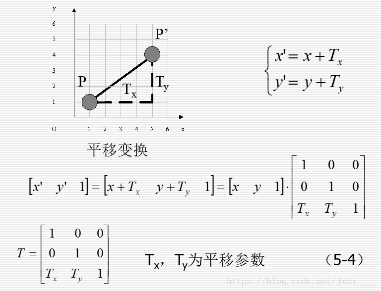
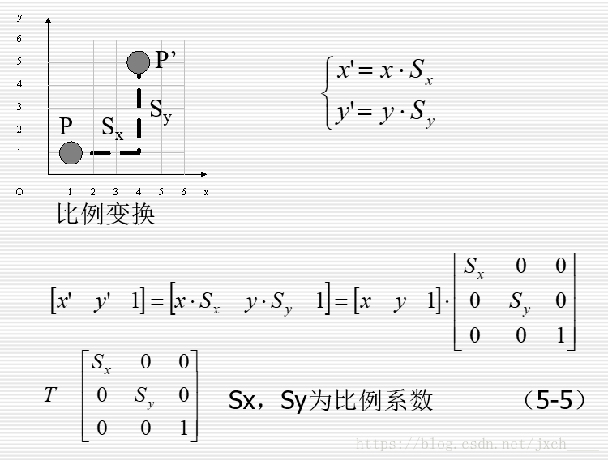
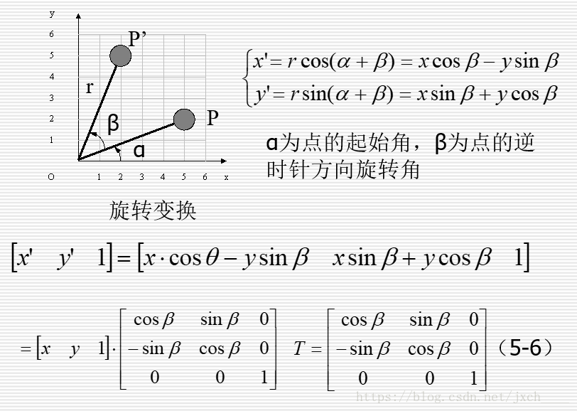
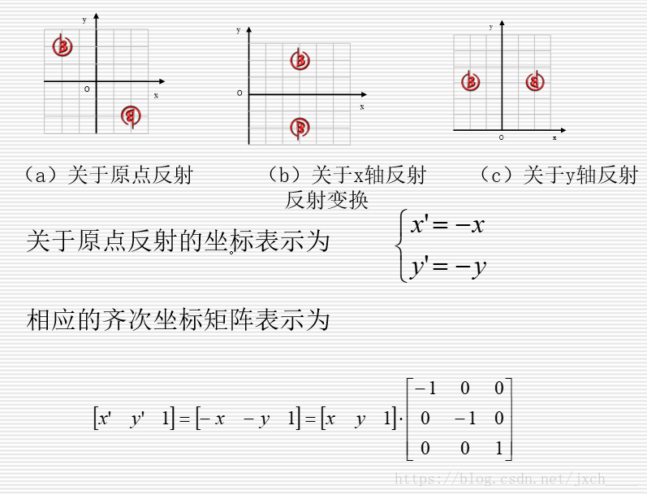

## CGAffineTransform类

​	最近项目需要对相机输入的流做一些旋转、缩放等操作，相机输入的数据类型是`CVPixelBufferRef`,需要我们将二维图片在OC层转换成`cv::Mat`数据传输给算法，下面是开发过程中的一些学习资料整理。

#### 一、数学原理

​	矩阵相关的基本知识就不介绍。[wiki矩阵介绍](https://zh.wikipedia.org/wiki/%E7%BA%BF%E6%80%A7%E4%BB%A3%E6%95%B0)

​	下面介绍一些矩阵相关的运算。基本的几何变换都是相对于坐标原点和坐标轴进行的几何变换，有平移、比例、旋转、反射和错切。

###### 1.1 平移变换矩阵

​	

我们原始的位置是`[x y 1]` 变换矩阵的为`[1 0 0 0 1 0 Tx Ty 1]` 即我们需要沿x和y方向的移动距离。

###### 1.2比例变换矩阵

 

###### 1.3旋转变换矩阵

 

###### 1.4反射变换矩阵

 

i、关于原点的二维反射变换矩阵为
$$
T = \left[
\matrix{
  \ -1  &  0 &   0\\
  \  0  & -1 &   0\\
  \  0  &  0 &  -1 
}
\right]
$$
ii、关于X轴的二维反射变换矩阵
$$
T = \left[
\matrix{
  \ 1  &  0 &   0\\
  \ 0  & -1 &   0\\
  \ 0  &  0 &   1 
}
\right]
$$
iii、关于Y轴的二维反射变换矩阵
$$
T = \left [
\matrix {
\ -1 &  0 &  0 \\
\  0 &  1 &  0 \\
\  0 &  0 &  1
}
\right]
$$

###### 1.5 错切变换矩阵


###### 1.6 复合平移矩阵

​	对同一个图形做两次平移相当于将两次的平移两次加起来：
$$
T(tx2,ty2) * T(tx1,ty1) = \left [
\matrix {
\  1 &  0 &  0 \\
\  0 &  1 &  0 \\
\  tx2 &  ty2 &  1
}
\right]

\left [
\matrix {
\  1 &  0 &  0 \\
\  0 &  1 &  0 \\
\  tx1 &  ty1 &  1
}
\right] = 
\left [
\matrix {
\ 1 & 0 & 0 \\
\ 0 & 1 & 0 \\
\ tx2+tx1 & ty2+ty1 & 1
}\right]
$$

###### 1.7 复合缩放矩阵

​	对同一个图片做两次连续的缩放相当于缩放的乘操作：
$$
S(sx2,sy2)*S(sx1,sy1) =
\left [
\matrix{
\ sx2 & 0 & 0 \\ 
\ 0 & sy2 & 0 \\
\ 0 & 0 & 1
}\right]
\left[
\matrix{
\ sx1 & 0   & 0 \\
\ 0   & sy1 & 0 \\
\ 0   & 0   & 1
}\right] = 
\left [
\matrix{
\ sx1*sx2 & 0 & 0 \\
\ 0 & sy1*sy2 & 0 \\
\ 0 & 0 & 1
}\right]
$$


###### 1.8 复合旋转矩阵

​	对同一张图片进行两次选装相当于将两次的旋转角度相加
$$
R(θ1+θ2) = R(θ1)+R(θ2)=
\left [
\matrix{
\ cos(θ2+θ1)  & sin(θ1+θ2)  & 0\\
\ -sin(θ2+θ1) & cos(θ2+θ1)  & 1\\
\ 0 & 0 & 1
}
\right]
$$


###### 1.9 相对点`(x,y)`的旋转矩阵

​	绕点`(x,y)`进行旋转变换。我们先将坐标中心变换到我们旋转的点，旋转完成后再变换回来。

​	
$$
R(xf,yf,θ) = T(-xf,-yf)*R(θ)*T(xf,yf)= \\
\left[
\matrix{
\ 1 & 0 & 1 \\
\ 0 & 1 & 0 \\
\ -xf & -yf & 1
}\right
]
\left[
\matrix{
\ cosθ & sinθ 0 \\
\ -sinθ & cosθ 0 \\
\ 0 & 0 &1
} \right 
] 
\left[  
\matrix{
\ 1 & 0 & 1 \\
\ 0 & 1 & 0 \\
\ -xf & -yf & 1
}\right
] = \\

\left [
\matrix{
\ cosθ & sinθ & 0 \\
\ -sinθ & cosθ & 0 \\
\ xf(1-cosθ)+yf*sinθ & yf(1-cosθ)-xfsinθ & 1
}\right
]
$$


###### 1.10 相对点`(x,y)`的缩放变换矩阵

​	绕点`(x,y)`进行缩放变换
$$
S(xf,yf;sx,sy) = T(-xf,-yf)*S(sx,sy)*T(xf,yf) =\\
\left [
\matrix {
\ 1 & 0 & 0 \\
\ 0 & 1 & 0 \\
\ -xf & -yf & 1
}\right
]
\left [
\matrix {
\ sx & 0 & 0 \\
\ 0 & sy & 0 \\
\ 0 & 0 & 1
}\right
]
\left [
\matrix {
\ 1 & 0 & 0 \\
\ 0 & 1 & 0 \\
\ xf & yf & 1
}\right
] = \\
\left [
\matrix {
\ sx & 0 & 0 \\
\ 0 & sy & 0 \\
\ xf(1-sx) & yf(1-sy) & 1
}\right
]
$$

#### 二、CGAffineTransform 函数说明

​	首先我们认识一下这个CGAffineTransform类。

```objective-c
typedef struct CGAffineTransform CGAffineTransform;

struct CGAffineTransform {
  CGFloat a, b, c, d;
  CGFloat tx, ty;
};

#endif /* CF_DEFINES_CG_TYPES */

#ifndef CF_DEFINES_CGAFFINETRANSFORMCOMPONENTS
/*                      |------------------ CGAffineTransformComponents ----------------|
 *
 *      | a  b  0 |     | sx  0  0 |   |  1  0  0 |   | cos(t)  sin(t)  0 |   | 1  0  0 |
 *      | c  d  0 |  =  |  0 sy  0 | * | sh  1  0 | * |-sin(t)  cos(t)  0 | * | 0  1  0 |
 *      | tx ty 1 |     |  0  0  1 |   |  0  0  1 |   |   0       0     1 |   | tx ty 1 |
 *  CGAffineTransform      scale           shear            rotation          translation
 */

// 获取一个标准矩阵
CGAffineTransform tranform = CGAffineTransformIdentity;

transform = CGAffineTransformMake(a,b,c,d,x,y);

/* Return a transform which translates by `(tx, ty)':
     t' = [ 1 0 0 1 tx ty ] */
transform = CGAffineTransformMakeTranslation(x, y);

/* Return a transform which scales by `(sx, sy)':
     t' = [ sx 0 0 sy 0 0 ] */
transform = CGAffineTransformMakeScale(a,c);

/* Return a transform which rotates by `angle' radians:
     t' = [ cos(angle) sin(angle) -sin(angle) cos(angle) 0 0 ] */
transform = CGAffineTransformMakeRotation(3);

/* Rotate t' byangle’ radians and return the result:
t’ = [ cos(angle) sin(angle) -sin(angle) cos(angle) 0 0 ] t */
transform = CGAffineTransformRatate(tranform, 3)
  
/* Invert `t' and return the result. If `t' has zero determinant, then `t'
   is returned unchanged. */
transform = CGAffineTransformInvert(transform);

/* Concatenate `t2' to `t1' and return the result:
 t' = t1 * t2 */
transfrom = CGAffineTransformConcat(transform, transform);

/* Return true if `t1' and `t2' are equal, false otherwise. */
isTrue = CGAffineTransformEqualToTransform(transform, transform)
  
/* Transform 'point by' 't' and return result :
p` = p * t where p = [x y 1]*/
CGPoint point = CGPointAplyAffineTransform(CGPointMake(30,30), tranform); // importance 
```


#### 三、实际使用场景

1、我们需要将相机获取的pixelbuffer数据按照一定角度旋转并使用cvMat接受。

2、

#### 四、扩展链接

I、矩阵进阶学习。

II、CGAffineTransform进阶使用。